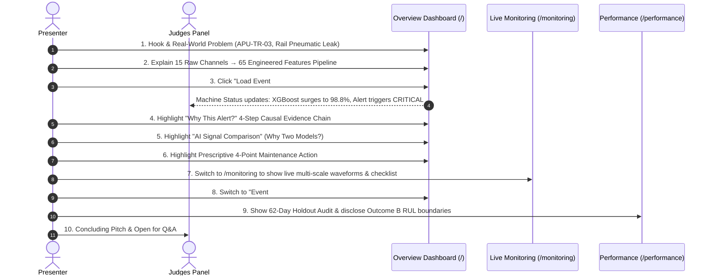

# MetroGuard AI — Final Hackathon Demonstration Checklist & Protocol

> **Event**: Hackathon Grand Finals  
> **Project**: MetroGuard AI — Industrial Predictive Maintenance for Urban Rail  
> **Asset**: `APU-TR-03` (MetroPT-3 Main Air Compressor & Desiccant Air Dryer)  
> **Application URL**: `http://127.0.0.1:8000/`

---

## 1. Before Leaving for the Venue

- [ ] **Laptop Battery & Power**: Laptop 100% charged + Power adapter packed in bag.
- [ ] **Display Dongles**: HDMI / USB-C adapter packed for projector connection.
- [ ] **Clean Codebase State**: Ensure no uncommitted debug prints or broken test scripts.
- [ ] **Pre-built Static Bundle**: `frontend/dist/` verified built with 0 errors (`npm run build`).
- [ ] **Pre-cached Scenarios**: `data/processed/streaming_scenarios_cache.pkl` present for instant 2ms startup.
- [ ] **Offline Independence**: Verify full application starts locally on `127.0.0.1:8000` with **zero internet connection required**.

---

## 2. 5 Minutes Before Taking the Presentation Stage

1. **Start the FastAPI Backend**:
   ```powershell
   python -m uvicorn backend.main:app --host 127.0.0.1 --port 8000
   ```
2. **Open the Browser Tabs in Advance (Full-Screen / 100% Zoom)**:
   - **Tab 1 (Main Stage)**: `http://127.0.0.1:8000/` (Overview Dashboard)
   - **Tab 2 (Technical Command)**: `http://127.0.0.1:8000/monitoring` (Live Monitoring & Alerts)
   - **Tab 3 (AI Architecture)**: `http://127.0.0.1:8000/risk` (AI Risk & Diagnostic Radar)
   - **Tab 4 (Scientific Integrity)**: `http://127.0.0.1:8000/performance` (Model Performance & Holdout Audit)
   - **Tab 5 (Real-World Case Studies)**: `http://127.0.0.1:8000/case-study` (Case 01 & Case 02 Timelines)
3. **Verify Replay State**:
   - On Tab 1 (Overview), select **Scenario 1: Normal Baseline** and confirm indicators show **`NORMAL`** ($0.03\%$ risk, $19\text{/100}$ anomaly severity).
   - Set speed multiplier to **`5x Demo`**.

---

## 3. Recommended Live Demonstration Sequence (8–10 Minutes)



### Detailed Script Outline:
1. **0:00 – 1:15 | The Hook & Overview Storytelling (`http://127.0.0.1:8000/`)**:
   - "Good morning, judges. In passenger rail transit, compressor failure strands trains in tunnels. MetroGuard AI provides 30-minute early warnings and evidence-based prescriptive actions."
   - Click **`Load Event #1 (Breakdown)`** $\rightarrow$ Press **`▶ Start Replay`** ($5\text{x}$).
   - Watch live machine status update: XGBoost surges to **$98.8\%$**, triggering a **`CRITICAL`** incident alert.
2. **1:15 – 2:30 | "Why This Alert?" & Dual-Model Comparison**:
   - Point to the **Why This Alert?** box: 1. Physical $H1$ separator drop deviation ($+2.44\sigma$), 2. Supervised XGBoost pre-failure pattern detection, 3. Production threshold crossed ($\tau = 0.10$), 4. Deterministic hybrid escalation.
   - Explain **Why Two Models?**: Supervised XGBoost recognizes known leak signatures; Unsupervised Isolation Forest acts as a safety net for out-of-distribution seasonal regimes.
3. **2:30 – 4:00 | Detailed Monitoring & Prescriptive Action (`http://127.0.0.1:8000/monitoring`)**:
   - Click *"Detailed Monitoring & Alerts →"* to show seamless synchronization on the active stream.
   - Point to the **4-Point Prescriptive Maintenance Checklist** and click **Acknowledge Alert**.
4. **4:00 – 5:30 | Seasonal Distribution Shift (`Load Event #4`)**:
   - Select **Scenario 4: Summer Holdout**.
   - Show how Isolation Forest catches the **$+3.69\sigma$ ($81.4^\circ\text{C}$)** thermal overload with `WARNING / HIGH Priority` when supervised ML was blind due to lack of summer labels.
5. **5:30 – 7:00 | Scientific Integrity & Outcome B (`http://127.0.0.1:8000/performance`)**:
   - Show the 62-day summer holdout partition ($441,980$ rows).
   - Explain why accuracy is misleading ($97.77\%$) on $0.041\%$ class imbalance and present ROC-AUC ($0.9797$).
   - Disclose **Outcome B**: with $N=4$ failure cycles across 7 months, continuous countdown regression is unfeasible, which is why MetroGuard provides validated 30-minute early warning classification instead.

---

## 4. Emergency Recovery Protocol

| Issue Observed | Immediate Diagnostic | Exact Recovery Step |
| :--- | :--- | :--- |
| **`ERR_CONNECTION_REFUSED` on port 8000** | FastAPI backend process is not running. | Run in terminal: `python -m uvicorn backend.main:app --host 127.0.0.1 --port 8000` |
| **Port 8000 Already in Use** | Another local process or previous Python instance is holding port 8000. | In PowerShell: `Get-Process python \| Stop-Process -Force`, then relaunch Uvicorn. |
| **Replay Stream Paused / Frozen** | User clicked Pause or playback reached episode end. | Click **`↻ Reset`** on the Replay Bar, or click **`[ Reset Normal Baseline ]`**. |
| **Browser Accidental Hard Refresh** | Replay returns to current stream position. | Replay automatically reconnects via polling. Select the scenario card to restart the desired episode. |
| **Lightning Pitch (Time Cut to 2–3 Min)** | Presentation shortened by judges. | Follow the **3-Minute Emergency Lightning Pitch** in `docs/HACKATHON_DEMO_SCRIPT.md`: Jump straight to Overview $\rightarrow$ Replay Event #1 $\rightarrow$ Show Why This Alert $\rightarrow$ Show Event #4 $\rightarrow$ Close. |

---

## 5. Judge Golden Rules

1. **Say**: *"15 raw telemetry channels producing 65 engineered time-series features"*.
2. **Never Say**: *"65 sensors"* or *"65 physical sensors"*.
3. **Explain Dual Models**: XGBoost = Pattern Matcher; Isolation Forest = Safety Net; Hybrid = Deterministic Decision.
4. **Explain Class Imbalance**: On $0.041\%$ failures, accuracy is meaningless; PR-AUC and event recall matter.
5. **Explain RUL Honesty**: $N=4$ failure cycles make continuous countdown regression statistically unsound; we provide 30-minute early warning classification.
